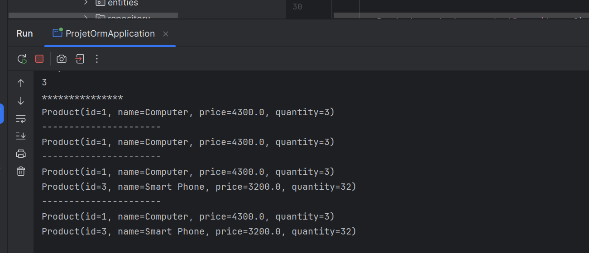
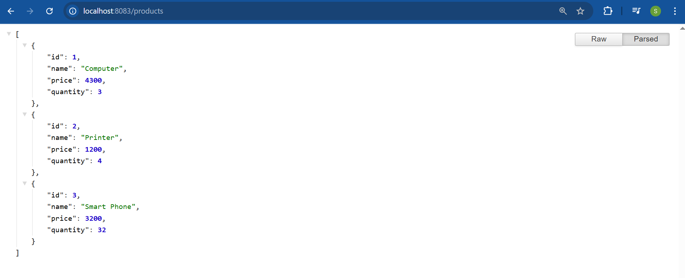
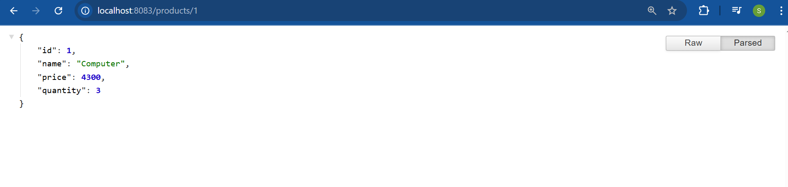
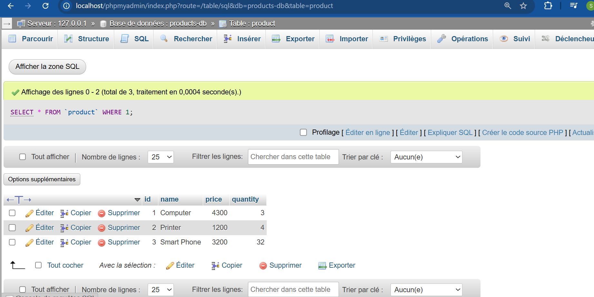

# Projet ORM avec Spring Boot et JPA

Pour ce projet, j’ai voulu apprendre à utiliser Spring Boot avec JPA pour gérer des données dans une base de données. J’ai commencé par installer IntelliJ Ultimate et créer un projet Spring Initializer avec les dépendances nécessaires : JPA, H2, Spring Web et Lombok. L’idée était de créer une application simple pour gérer des produits et expérimenter les différentes opérations possibles avec Spring Data.

## Création de l'entité Product

J’ai créé l’entité JPA **Product** avec les attributs `id`, `name`, `price` et `quantity`. L’id est de type `Long` et est généré automatiquement, tandis que `name` est une chaîne de caractères, `price` un double et `quantity` un entier. J’ai utilisé les annotations `@Entity`, `@Id`, `@GeneratedValue` et Lombok pour simplifier le code, ce qui m’a permis de ne pas écrire les getters et setters à la main. Cela a rendu le code beaucoup plus lisible et rapide à développer.

## Création du ProductRepository

Ensuite, j’ai créé l’interface **ProductRepository** qui étend `JpaRepository`. Cela m’a donné automatiquement toutes les opérations CRUD classiques. J’ai ajouté quelques méthodes personnalisées pour chercher des produits par nom ou par prix, et pour faire des recherches plus flexibles avec l’annotation `@Query`. J’ai trouvé intéressant de voir à quel point Spring Data simplifie le développement : il suffit de définir l’interface et Spring se charge de générer l’implémentation.

## Tests et CommandLineRunner

Pour tester le projet, j’ai utilisé la classe **ProjetOrmApplication** qui implémente `CommandLineRunner`. Dans la méthode `run`, j’ai ajouté quelques produits dans la base, consulté tous les produits, récupéré un produit précis par son id et testé les différentes méthodes de recherche. Cela m’a permis de vérifier que toutes mes méthodes de repository fonctionnaient correctement et que les requêtes personnalisées donnaient bien les résultats attendus.

## Migration H2 vers MySQL

Après avoir testé avec H2, j’ai migré la base de données vers MySQL pour voir comment Spring Boot et JPA se comportent avec une vraie base. La migration a été simple : il suffisait de changer la configuration dans le fichier `application.properties` et d’adapter l’URL, le nom d’utilisateur et le mot de passe. Tout le reste du code est resté identique, ce qui montre la puissance de Spring et JPA pour gérer la persistance de manière transparente.

## Approfondissement avec Patient, Médecin et Rendez-vous

Enfin, j’ai repris les exemples vus dans la vidéo sur la gestion de patients, médecins, rendez-vous, consultations, utilisateurs et rôles. J’ai utilisé la même logique que pour les produits, en créant les entités correspondantes, les repositories et quelques tests dans `CommandLineRunner` pour vérifier que tout fonctionnait. Cela m’a permis de mieux comprendre comment structurer une application complète avec plusieurs entités et leurs relations, tout en restant simple à maintenir grâce à Spring Data.

## Conclusion

Avec ce projet, j’ai vraiment compris l’intérêt de Spring Boot, JPA et Spring Data pour créer rapidement des applications qui interagissent avec une base de données. J’ai appris à créer des entités, à écrire des repositories, à utiliser des requêtes personnalisées et à migrer facilement entre H2 et MySQL. Tout cela m’a donné une bonne base pour continuer à développer des applications plus complexes avec Spring.

## Captures d’écran

